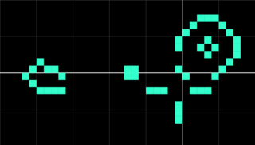
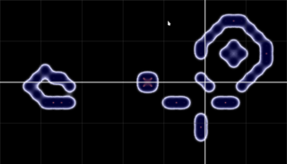

# Golgi

## What it is

This is a "Cellular" Viewer for Conway's Game of Life.
See it in action: <http://mame.github.io/golgi/>

## Features

* "Cell view" mode based on WebGL (using [THREE.js](http://threejs.org/))
* [Hashlife](http://en.wikipedia.org/wiki/Hashlife) implementation in Javascript

## Screenshot
Normal view mode:

Cell view mode:

Demo video on Youtube:

* <http://www.youtube.com/watch?v=vbk22KTfS_Q>
* <http://www.youtube.com/watch?v=culau1UMqpQ>

## License

* `vendor/all.zip` is produced by [LifeWiki](http://www.conwaylife.com/wiki/Main_Page) under GFDL.
* `vendor/three.js` is provided by [three.js project](http://threejs.org/) under MIT License.
* Everything else are under MIT License.

Copyright (c) 2013 [Yusuke Endoh (@mametter)](http://twitter.com/mametter/), [@hirekoke](http://twitter.com/hirekoke/)

MIT License

Permission is hereby granted, free of charge, to any person obtaining
a copy of this software and associated documentation files (the
"Software"), to deal in the Software without restriction, including
without limitation the rights to use, copy, modify, merge, publish,
distribute, sublicense, and/or sell copies of the Software, and to
permit persons to whom the Software is furnished to do so, subject to
the following conditions:

The above copyright notice and this permission notice shall be
included in all copies or substantial portions of the Software.

THE SOFTWARE IS PROVIDED "AS IS", WITHOUT WARRANTY OF ANY KIND,
EXPRESS OR IMPLIED, INCLUDING BUT NOT LIMITED TO THE WARRANTIES OF
MERCHANTABILITY, FITNESS FOR A PARTICULAR PURPOSE AND
NONINFRINGEMENT. IN NO EVENT SHALL THE AUTHORS OR COPYRIGHT HOLDERS BE
LIABLE FOR ANY CLAIM, DAMAGES OR OTHER LIABILITY, WHETHER IN AN ACTION
OF CONTRACT, TORT OR OTHERWISE, ARISING FROM, OUT OF OR IN CONNECTION
WITH THE SOFTWARE OR THE USE OR OTHER DEALINGS IN THE SOFTWARE.
